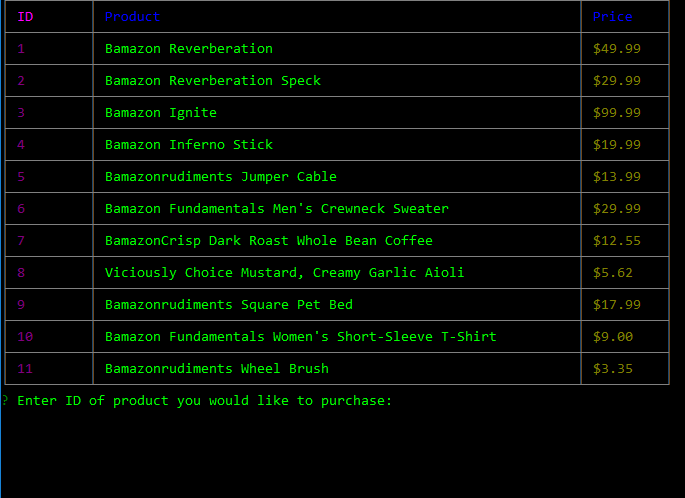
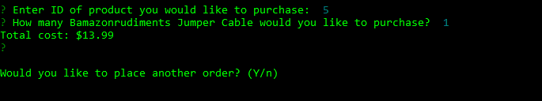
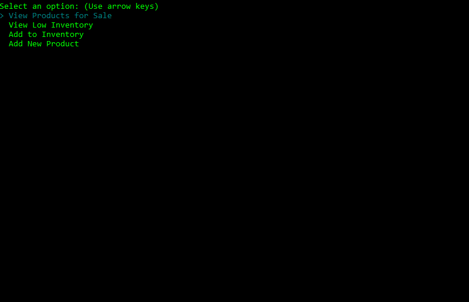
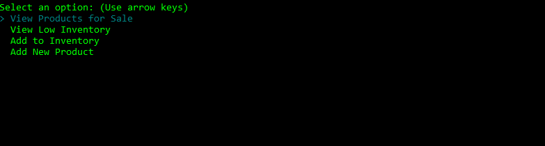
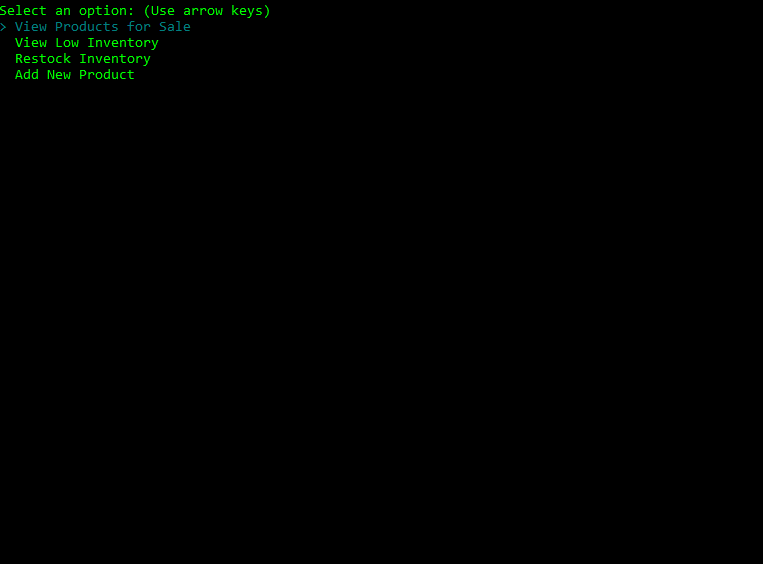

# bamazon
Amazon-like storefront CLI app

## Set up Bamazon
-----------------------------
**_Prerequisites_**
**In order to use Bamazon, ensure you have nodeJS installed.**
**Dependent node packages are listed in the package.json file.**

- Download files:
    - Download bamazon from https://github.com/HillerDavid/bamazon
    

- Install node packages:
    - Open a terminal.
    - Navigate to bamazon folder containing **bamazonCustomer.js**, **bamazonManager.js**.
    - Enter the command ```npm i```.

## How to use Bamazon
-----------------------------
**All commands should be entered looking in bamazon folder in a terminal.**

## Launch as Customer
- Enter ```node bamazonCustomer.js```


### Place Order
- Enter id number of product you would like to purchase
- Enter quantity of item you would like to order


### Order More or Quit
- Enter ```y``` to go back to order selection
- Enter ```n``` to quit


### Launch as Manager
- Enter ```node bamazonManager.js```


### View Current Inventory
- Select ```View Products for Sale```


### View Low Inventory
- Select ```View Low Inventory```


### Restock Inventory
- Select ```Restock Inventory```
- Enter id number of product you wish to replenish inventory
- Enter quantity you would like to add to inventory


### Add New Product to Inventory
- Select ```Add New Product```
